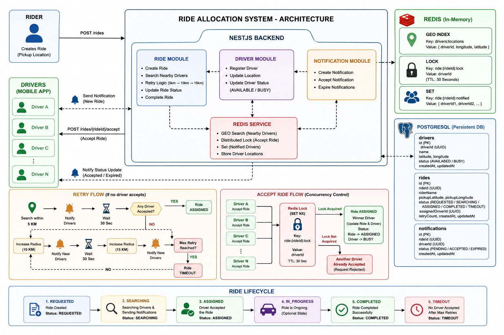

# 🚖 Ride Allocation System

A high-concurrency ride allocation system built with **NestJS**, **PostgreSQL**, and **Redis**.

The system finds nearby drivers using Redis GEO commands, notifies eligible drivers, ensures that only one driver can accept a ride using a Redis distributed lock, retries allocation when no driver accepts within a timeout, and manages the complete ride lifecycle.

---

# Tech Stack

- NestJS
- TypeScript
- PostgreSQL
- Redis
- Sequelize ORM
- Axios (Concurrency Testing)

---

# Features

## ✅ Geo-Based Driver Search

- Driver locations are stored in Redis using GEO commands.
- Nearby drivers are searched within a configurable radius (default 5 km).
- Driver locations can be updated dynamically.

---

## ✅ Ride Lifecycle

The ride goes through the following states:

```
REQUESTED
     │
     ▼
SEARCHING
     │
     ├────────────► ASSIGNED
     │                  │
     │                  ▼
     │             COMPLETED
     │
     ▼
TIMEOUT
```

---

## ✅ Distributed Lock

To avoid race conditions:

- Multiple drivers can click **Accept** simultaneously.
- Redis `SET NX EX` is used as a distributed lock.
- Only one driver successfully acquires the ride.
- Remaining drivers receive a rejection response.

---

## ✅ Retry Logic

If no driver accepts:

- Search within **5 km**
- Wait 30 seconds

↓

- Search within **10 km**
- Notify only new drivers

↓

- Wait 30 seconds

↓

- Search within **15 km**

↓

- Maximum retries reached

↓

Ride status becomes **TIMEOUT**

Already-notified drivers are never notified again.

---

## ✅ Notification Management

Each nearby driver receives a notification.

Notification states:

```
PENDING
ACCEPTED
EXPIRED
```

If one driver accepts:

- Accepted driver's notification → ACCEPTED
- Remaining notifications → EXPIRED

If ride times out:

All pending notifications become EXPIRED.

---

## ✅ Driver Status

```
AVAILABLE
     │
Ride Assigned
     │
     ▼
BUSY
     │
Ride Completed
     │
     ▼
AVAILABLE
```

---

# System Architecture

```
                      Rider
                        │
                 POST /rides
                        │
                        ▼
                NestJS Backend
                        │
         Save Ride (REQUESTED)
                        │
                        ▼
              PostgreSQL (Ride)
                        │
                        ▼
          Status → SEARCHING
                        │
                        ▼
          Redis GEO Search (5 KM)
                        │
                        ▼
        Find Nearby Driver IDs
                        │
                        ▼
       PostgreSQL (Available Drivers)
                        │
                        ▼
      Create Driver Notifications
                        │
                        ▼
            Drivers Receive Request
                        │
        ┌───────────────┼───────────────┐
        ▼               ▼               ▼
     Driver A        Driver B       Driver C
        │               │               │
        └──────Accept Ride──────────────┘
                        │
                        ▼
             Redis Distributed Lock
            SET ride:lock NX EX 30
                        │
          ┌─────────────┴─────────────┐
          ▼                           ▼
 Lock Acquired                 Lock Failed
          │                           │
          ▼                           ▼
Assign Ride                 Reject Request
          │
          ▼
Ride → ASSIGNED
Driver → BUSY
Notifications Updated
          │
          ▼
Ride Completed
          │
          ▼
Ride → COMPLETED
Driver → AVAILABLE
Release Redis Lock
```

---

# Project Structure

```
src
│
├── driver
│
├── ride
│
├── notification
│
├── redis
│
├── app.module.ts
│
└── main.ts
```

---

# Installation

## Clone Repository

```bash
git clone <repository-url>
```

```
cd backend
```

---

## Install Dependencies

```bash
npm install
```

---

## Configure Environment Variables

Create a `.env` file.

```
DB_HOST=localhost
DB_PORT=5432
DB_USERNAME=postgres
DB_PASSWORD=your_password
DB_NAME=ride_allocation

REDIS_HOST=localhost
REDIS_PORT=6379
```

---

## Start PostgreSQL

Make sure PostgreSQL is running.

---

## Start Redis

```
redis-server
```

---

## Start Application

```
npm run start:dev
```

Server starts on

```
http://localhost:3000
```

---

# API Endpoints

## Create Driver

```
POST /drivers
```

---

## Get Nearby Drivers

```
GET /drivers/nearby
```

---

## Create Ride

```
POST /rides
```

---

## Accept Ride

```
POST /rides/:rideId/accept
```

---

## Complete Ride

```
POST /rides/:rideId/complete
```

---

# Concurrency Test

A concurrency test script is included.

Run:

```
node scripts/concurrency-test.js
```

The script sends multiple driver acceptance requests simultaneously.

Expected Result:

```
1 Driver
↓

Ride Assigned

Remaining Drivers

↓

Another driver has already accepted this ride.
```

This verifies that Redis distributed locking prevents duplicate assignments.

---

# Redis Usage

| Purpose              | Redis Feature |
| -------------------- | ------------- |
| Driver Location      | GEOADD        |
| Nearby Driver Search | GEOSEARCH     |
| Ride Lock            | SET NX EX     |
| Notified Drivers     | Redis Set     |
| Lock Release         | DEL           |

---

# Database Tables

## Drivers

- driverId
- name
- latitude
- longitude
- status

---

## Rides

- rideId
- riderName
- pickupLatitude
- pickupLongitude
- status
- retryCount
- assignedDriverId

---

## Notifications

- notificationId
- rideId
- driverId
- status

---

# Future Improvements

- WebSocket-based real-time notifications
- Push notifications
- Driver ETA estimation
- Driver ranking
- Trip history
- Authentication & Authorization
- Docker Compose deployment
- Unit & Integration tests

---

# Author

**Ponnana Pavan**

<h2>System Architecture</h2>

<p align="center">
  
</p>
